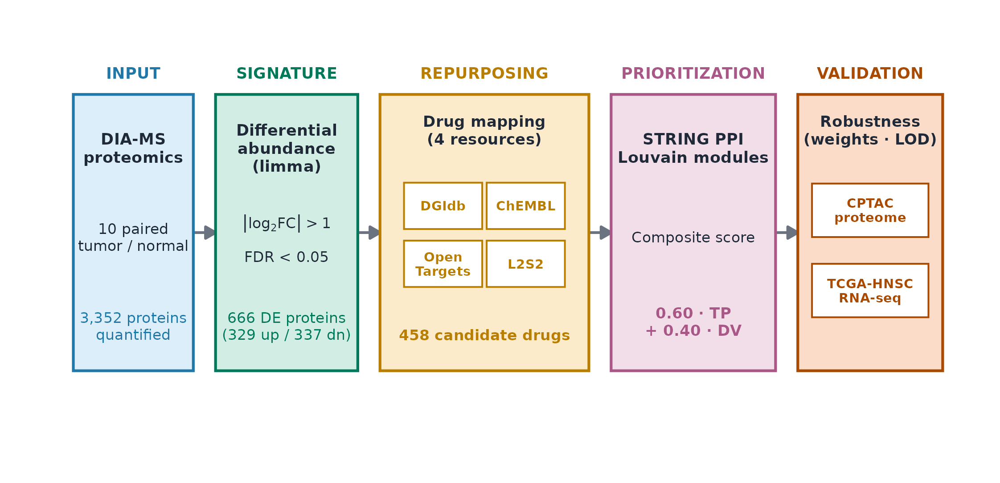
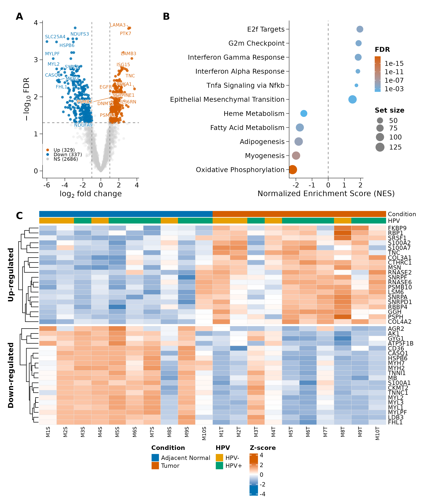
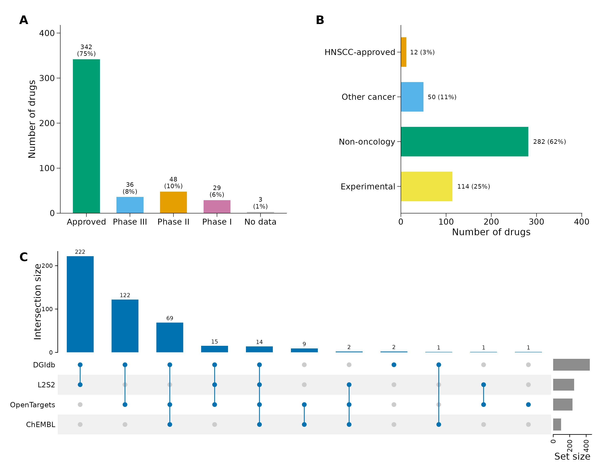
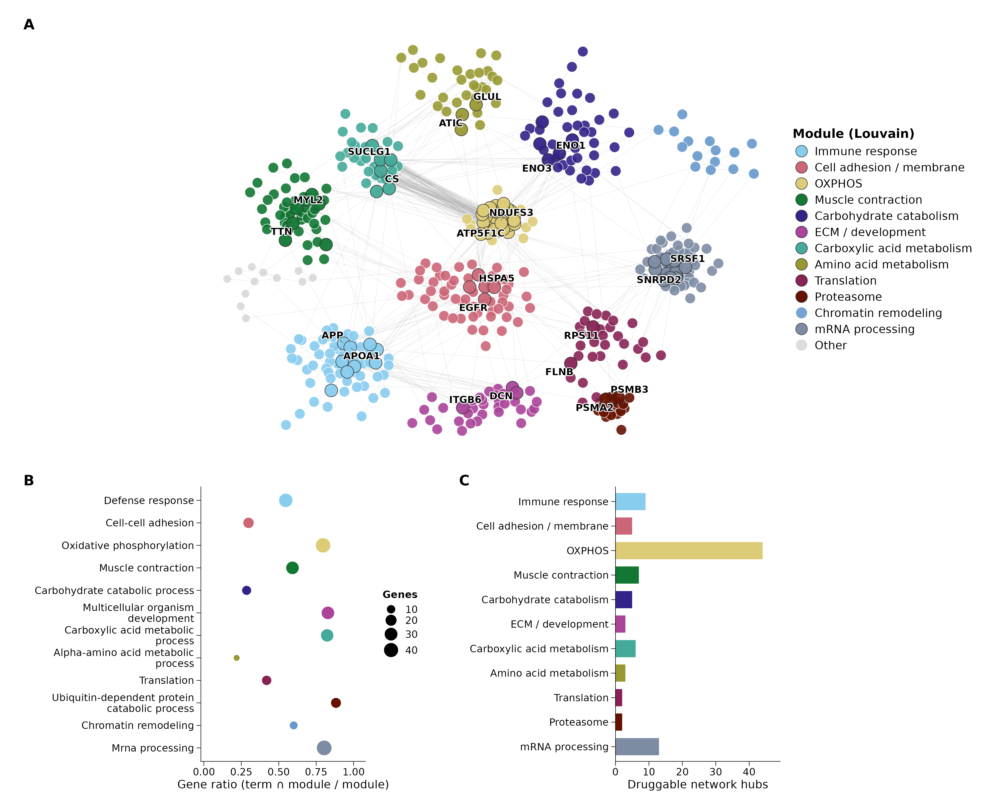
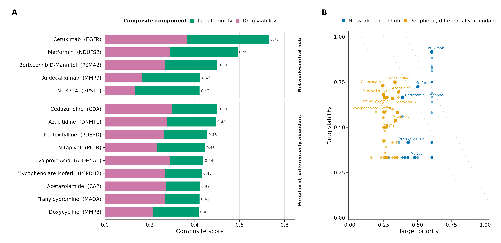
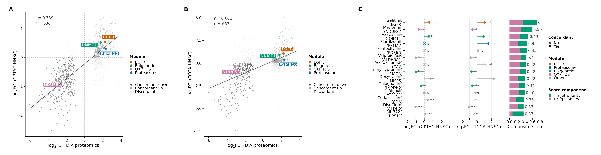

# Network-anchored proteomic drug repurposing in HNSCC (working draft, preview)

Partial preview for pipeline testing: Introduction, Methods, Results, main-body figures (Fig 1-6) and the prioritized-candidate main table (Table 1). Discussion, Abstract, Title and complete Methods/Results citations are pending (WRITING_PLAN.md steps 5-8). Citations shown are PubMed-verified; the bibliography is generated by pandoc / scanned in Zotero.

## Introduction

Head and neck squamous cell carcinoma (HNSCC) is among the leading causes of cancer morbidity and
mortality worldwide, and overall survival remains limited, particularly in locally advanced and
recurrent disease. [@johnson2020; @sung2021] Despite advances across surgery,
radiotherapy, chemotherapy, and immunotherapy, outcomes are still poor, a reflection of how
biologically complex the disease is. [@johnson2020]

Over the past decade, management has shifted with the introduction of immune-checkpoint
inhibitors. The phase 3 KEYNOTE-048 trial established pembrolizumab (as monotherapy in
PD-L1-positive patients or combined with platinum/5-fluorouracil) as the first-line standard for
recurrent or metastatic disease, with patient selection guided by the combined positive score
(CPS). [@burtness2019] More recently, KEYNOTE-689 reported that perioperative
pembrolizumab added to standard of care significantly improves event-free survival in
locally advanced, resectable disease, a setting where progress had been comparatively slow.
[@uppaluri2025] These advances highlight the need to find new molecular signatures
and therapeutic targets to improve systemic and perioperative treatment.

A central challenge in HNSCC is its molecular heterogeneity. The distinction between
human-papillomavirus (HPV)-associated tumors and those linked to tobacco and alcohol has defined
subgroups with substantial prognostic and biological differences, yet this stratification remains
insufficient to capture the functional complexity of the tumor. [@ang2010]
Proteomics helps here because it gives a direct picture of the tumor's functional state:
unlike genomic or transcriptomic profiles, the proteome reflects what cells are actually doing,
capturing both post-transcriptional and post-translational regulation. [@aebersold2016] Proteomic studies have repeatedly found changes in EGFR signaling,
energy metabolism, and the tumor microenvironment in HNSCC. [@huang2021]

Drug repurposing, the reuse of approved drugs whose safety is already known, is an efficient way
to speed up the search for new treatment options, and combining a tumor's molecular signature
with pharmacological-connectivity resources can point to drugs predicted to reverse the disease
state. [@pushpakom2019; @napolitano2013] Connectivity-based approaches typically prioritize
candidates by how strongly a drug reverses the transcriptomic signature [@lamb2006; @subramanian2017; @evangelista2025], while target-centric selection often relies on the size of
the protein or expression change. Ranking by signature reversal or effect size alone, however,
does not capture where a target sits in the tumor's molecular network, a property that network
medicine links to biological importance [@barabasi2011], and it leaves aside
whether the candidate drug can realistically be used in the clinic (approval status, regulatory
class) or whether the change in its target reproduces beyond a single cohort. A shortlist that is
both believable and usable for a translational reader needs an approach that brings these pieces
together: where the target sits in the network, how ready the drug is for the clinic, and whether
the signal reproduces across cohorts.

Our aim was to build and prioritize a credible, mechanistically organized shortlist of
drug-repurposing candidates for HNSCC by combining quantitative proteomics of paired tumors with
pharmacological evidence from several sources and the structure of the protein–protein
interaction network. Candidates were ranked not by the size of the protein change alone but by
where each target sits in the tumor network and how ready its drug is for clinical use. To check
that the approach is trustworthy, we asked whether it recovers the EGFR axis (the main target with
approved therapy in HNSCC) as a built-in positive control, and we tested whether the direction of
change in the prioritized targets agrees across two independent cohorts (a CPTAC proteome and a
TCGA transcriptome). The study was designed both to recover known targets and to bring forward
new, biologically interpretable vulnerabilities with translational potential.

## Methods

### Proteomic data and differential abundance

Data-independent acquisition (DIA) proteomics was performed on ten paired tumor and
adjacent-normal specimens from patients with head and neck squamous cell carcinoma (HNSCC; n = 20
samples; six HPV-positive and four HPV-negative pairs). Spectra were processed with MaxQuant, and
differential abundance was assessed with proteoDA [@ritchie2015], a limma wrapper, for the primary tumor-versus-
adjacent-normal contrast (averaging over HPV status). Proteins were considered differentially
abundant at |log₂FC| > 1 and Benjamini–Hochberg-adjusted P < 0.05. UniProt accessions were mapped
to Entrez gene identifiers and HGNC symbols with `org.Hs.eg.db` (clusterProfiler [@wu2021] `bitr`). To check
that differential abundance was not driven by the muscle- and mucosa-rich composition of the
adjacent-normal tongue and larynx specimens, the enrichment and network analyses were repeated
after excluding a curated set of tissue-composition markers (skeletal/cardiac muscle and
airway/secretory proteins); this left the prioritized targets and the Hallmark [@liberzon2015] results essentially
unchanged (Table S2).

### Functional enrichment

Gene-set enrichment analysis (GSEA) [@subramanian2005] was performed with clusterProfiler (v4.14.6), ranking proteins
by a π-statistic [sign(log₂FC) × |log₂FC| × −log₁₀(adjusted P)] against the MSigDB Hallmark, Gene
Ontology Biological Process, KEGG, and Reactome collections (minGSSize = 10, maxGSSize = 500,
adjusted P < 0.05; fixed seed for reproducible permutations).

### Drug–target mapping and integration

Differentially abundant genes were queried against four pharmacological resources: DGIdb [@freshour2021] (GraphQL
API v5), ChEMBL [@mendez2019] (REST API v33, clinical phase ≥ 3), Open Targets [@ochoa2021] (GraphQL API; HNSCC association
EFO_0000181 and known drugs), and L2S2 [@evangelista2025] (LINCS L1000 Signature Search; bidirectional enrichment of
the top-150 up-regulated proteins against drug down-signatures and vice versa, FDA-approved filter,
P < 0.001; reversal score normalized to [−1, 0]). Sources were unified and each drug assigned an
ordinal regulatory class encoding regulatory maturity (not pharmacological equivalence): A =
approved with HNSCC evidence, B = approved in another cancer, C = approved
non-oncological, D = experimental (ordinal scores 1.00/0.75/0.50/0.25). Automated indication
matching was manually corrected for seven known mismatches (for example, cetuximab, pembrolizumab
and nivolumab were reassigned to class A as agents approved in HNSCC but missed by EFO matching);
the complete list of overrides is given in Table S6. Drugs entering prioritization were those
supported by ≥ 2 databases or already approved (class A/B retained even if single-source), after
removal of a curated exclusion list.

### Protein–protein interaction network

A high-confidence interaction network was built from the differentially abundant proteins using
STRING [@szklarczyk2023] v12 (combined score ≥ 700). The largest connected component of the network was characterized
by degree, betweenness, and eigenvector centrality (igraph v2.2.2); hubs were defined as the top
decile by degree. Louvain community detection partitioned this component into modules, each named
by its top-enriched GO Biological Process term. Druggable hubs were the hubs intersecting the drug-target set. Each module
was assigned a data-driven drugability tier (containing an approved-drug target; containing
druggable hubs only; or below threshold).

### Network-anchored two-factor prioritization

Each candidate was scored with a composite that anchors prioritization in network structure
(network → module → druggable hub → drug):

`composite = 0.60 · TargetPriority + 0.40 · DrugViability`

TargetPriority (target-level) = 0.55 · network centrality (mean of min–max-normalized degree,
betweenness, eigenvector) + 0.45 · directional differential abundance (π = sign(log₂FC)·|log₂FC|·
−log₁₀FDR, direction-aware min–max). This π term is signed and rewards inhibition of over-abundant
targets; as a result, under-abundant targets (including potential loss-of-function/tumor-
suppressor nodes) are down-weighted by this term, and metabolic targets such as Complex I subunits
are prioritized through direction-independent centrality and external evidence rather than
through π. DrugViability (drug-level; breaks ties among drugs sharing a target) =
0.40 · L2S2 transcriptomic reversal + 0.40 · regulatory class + 0.20 · evidence breadth (databases
/ 4). Each drug was assigned to its most central credible target, where a drug→target edge is
credible only if curated by ChEMBL or Open Targets (DGIdb-only edges were excluded as attribution
anchors because DGIdb interaction scores are promiscuous and do not reliably reflect mechanism of
action). A target that is a network hub defines the hub-central tier; a credible non-hub target the
peripheral-differential tier. Anchor genes lacking antitumoral plausibility or reflecting sample
contamination were excluded via a curated configuration list. By design, network topology is the
dominant driver of the composite, with DrugViability acting primarily as a clinical/pharmacological
tie-breaker among agents sharing a target.

### Robustness

Ranking stability was assessed by weight-perturbation sensitivity (six configurations varying the
target/drug balance and the sub-weights) and by leave-one-database (LOD) stability. No permutation
null was used: for an evidence-aggregation prioritization score (rather than a de novo discovery
statistic), its validity comes from recovering positive controls (approved EGFR-axis agents), from
robustness to the weighting and database choices, and from external corroboration, not from a
permutation P-value.

### External corroboration in two independent cohorts

Target directionality was corroborated, not tested for efficacy or rank order, in two independent
cohorts. The CPTAC-HNSCC TMT proteome (Huang et al., 2021 [@huang2021]) was retrieved with the `cptac` Python
package and analyzed by the same method as discovery (paired limma with duplicateCorrelation
blocking on patient; 116 tumor / 66 normal, 66 pairs). The TCGA-HNSC transcriptome (STAR-Counts
via TCGAbiolinks; 520 tumor / 44 normal) was analyzed with DESeq2 (v1.44). For each cohort, the
per-gene log₂FC was correlated with the DIA log₂FC over the set of shared genes (Pearson
correlation and directional-concordance fraction), and, for the shortlist anchor targets, per-gene
log₂FC and adjusted P were compared against the DIA proteome (directional concordance and FDR < 0.05
annotated per target). As a supplementary analysis, overall survival was stratified by median
expression of four module-representative genes (EGFR, PSMB10, DNMT1, NDUFS3) in TCGA-HNSC (476
patients with survival data) and compared by the log-rank test.

### Software and reproducibility

Analyses used R 4.4.3 (limma v3.62.2, clusterProfiler v4.14.6, ReactomePA v1.50.0, igraph v2.2.2,
ggraph v2.2.2, ComplexHeatmap v2.22.0, DESeq2 v1.44) and Python 3 (requests, pandas, numpy,
matplotlib; `cptac`). External resources: DGIdb v5, ChEMBL v33, Open Targets, L2S2 LINCS L1000
(Evangelista et al., 2025), STRING v12, and MSigDB Hallmark. A Data and Code Availability
statement will be provided at submission.

## Results

### Differential protein abundance in the HNSCC proteome

Data-independent acquisition proteomics of ten paired tumor and adjacent-normal specimens
quantified 3,352 proteins, all mapped to Entrez gene identifiers. A paired differential-abundance
analysis (limma; |log₂FC| > 1, FDR < 0.05) identified 666 differentially abundant proteins (19.9%
of the quantified proteome), comprising 329 over-abundant and 337 under-abundant proteins in
tumor relative to adjacent-normal tissue (Fig 2A; Table S1). Gene-set enrichment analysis against
the 50 MSigDB Hallmark gene sets returned 11 significantly enriched programs (FDR < 0.05; Fig 2C).
The most strongly down-regulated signature was oxidative phosphorylation (NES = −2.21), followed by
myogenesis (NES = −1.99) and adipogenesis (NES = −1.83).

The most extreme under-abundant proteins were dominated by skeletal/cardiac muscle (e.g., MYH2,
MYL1/2/3, CASQ1, TCAP, ATP2A1) and airway/secretory markers (BPIFA1, BPIFB1). These
tissue-composition markers accounted for 12.8% of down-regulated proteins overall but 80% of the
20 most extreme. In a sensitivity analysis excluding these markers (Methods; Table S2), the hub
status of all prioritized targets was unchanged (e.g., NDUFS2 degree 51→51; EGFR 24→23), the
oxidative-phosphorylation signature was retained and even slightly stronger (NES −2.21→−2.32), and
only the myogenesis hallmark weakened appreciably (NES −2.00→−1.56), confirming that our
conclusions about the prioritized targets and the OXPHOS axis hold up regardless of tissue composition.

### Multi-source druggable candidate space

Mapping the differentially abundant proteins to four pharmacological resources (DGIdb, ChEMBL,
Open Targets, L2S2) yielded 458 multi-source candidate drugs: agents supported by at least two
databases, or already approved (regulatory class A/B, retained even with a single source), after
a curated exclusion list (Fig 3). The candidate set spanned the full clinical-development
spectrum, with a substantial fraction of approved agents (Fig 3A–B), and the cross-source UpSet
plot confirmed that the candidates were not an artifact of any single database (Fig 3C). The
complete selection funnel is shown in Fig S1.

### Protein–protein interaction network and module structure

To prioritize by biological position rather than fold-change magnitude alone, we placed the
candidate targets in a high-confidence tumor protein–protein interaction network (STRING). Of the
differentially abundant proteins, 521 formed the network's largest connected component (2,714
interactions), which Louvain community detection partitioned into 13 functional modules (Fig 4A)
carrying 99 druggable hubs (Methods). Module-level Gene Ontology
enrichment assigned a coherent functional identity to each module (Fig 4B), and the per-module
hub counts (Fig 4C) defined the candidate anchors carried forward to prioritization. Modules were
classified by a data-driven drugability tier (containing an approved-drug target, druggable hubs
only, or below threshold); the most prominent axes corresponded to EGFR signaling, oxidative
phosphorylation, the proteasome, and epigenetic regulation.

### Network-anchored two-factor prioritization

Each candidate was scored by a composite that combines how important its target is biologically
with how ready the drug is for clinical use (`composite = 0.60·TargetPriority + 0.40·DrugViability`),
with every drug anchored to its most credible central target through a curated ChEMBL/Open Targets
edge (Fig 5; Table 1). TargetPriority combines network centrality with directional differential
abundance, and DrugViability combines transcriptomic reversal (L2S2), regulatory class, and how
many sources support the drug (Methods).

Without any disease-specific tuning, the prioritization elevated the EGFR axis (module M2) to the
top of the ranking: cetuximab ranked first (composite 0.73), accompanied by other approved
EGFR-directed agents (nimotuzumab, panitumumab, gefitinib, afatinib) (Table 1, EGFR control
block). Recovering these clinically validated EGFR-directed agents without supervision served as
an internal positive control for the method.

Beyond this control, the shortlist split into two interpretable tiers (Table 1; Fig 5A). The
hub-central tier contained candidates whose anchor is a network hub: metformin, anchored to the
Complex I subunit NDUFS2 within the oxidative-phosphorylation module (composite 0.591), and
proteasome-directed agents anchored to PSMA2/PSMB3. Notably, Complex I subunits were strongly
under-abundant in tumor (NDUFS2 log₂FC = −3.05); metformin rose to the top through the high
network centrality of its anchor, independent of fold-change direction, and we present it as a
metabolic-vulnerability and combination-therapy candidate rather than as inhibition of an
over-expressed target. The peripheral-differential tier held targets that are
differentially abundant but not network hubs, including the epigenetic regulators DNMT1
(decitabine/azacitidine) and MAOA (tranylcypromine) and the antimetabolite target IMPDH2
(thioguanine), alongside classical repurposing agents. The extended candidate list across all
modules is provided in Table S5, and candidate provenance in Table S3.

### External corroboration in two independent cohorts

To see whether the findings generalize, we asked whether the direction of change in the
prioritized targets reproduced in independent data (Fig 6). At the global level, the DIA proteome correlated with the
CPTAC-HNSCC TMT proteome (Pearson r = 0.789 over 636 shared genes; 86.3% directional concordance;
Fig 6A) and with the TCGA-HNSC transcriptome (r = 0.601 over 663 shared genes; 76.2% concordance;
Fig 6B). For the 14 shortlist anchor targets specifically (Fig 6C; Table S4), directional
concordance was observed for 11 of 12 anchors with CPTAC data and 11 of 14 with TCGA, with 10/12
and 12/14 reaching FDR < 0.05, respectively. Concordance was strong for the principal candidates
(EGFR, NDUFS2, DNMT1, PSMA2, ALDH5A1, MAOA, MMP8, IMPDH2, ALDH2) and weaker or discordant for four
anchors (PDE6D, CA2, CDA, RPS11), which we treat as lower-confidence nominations. These cohorts
corroborate the direction of change in the prioritized targets; they are not a test of drug
efficacy or of the candidate rank order.

### Robustness of the ranking

Finally, the candidate ranking was stable across six independent weight configurations and a
limit-of-detection filter (Fig S2). Consistent with the network-anchored design, the composite
ranking was strongly correlated with target network centrality alone (Spearman ρ = 0.78),
confirming that network topology, rather than the drug-level tie-breakers, was the dominant driver
of prioritization. Candidates flagged as LOD-stable, including the EGFR-axis
agents and the leading hub-central candidates, retained their positions across configurations
(Table 1, robustness columns), defining a robust core panel. In line with their role as
therapeutic vulnerabilities rather than prognostic markers, none of the four pillar genes (EGFR,
PSMB10, DNMT1, NDUFS3) was significantly associated with overall survival in TCGA-HNSC (all
p > 0.05; Fig S3).

# Figures

Figure 1. Study design and analytical workflow.

Overview of the drug-repurposing pipeline for head and neck squamous cell carcinoma (HNSCC).
Ten paired tumor / adjacent-normal specimens were profiled by data-independent acquisition
(DIA) mass spectrometry (MaxQuant), yielding 3,352 quantified proteins. Differential abundance
(limma, paired contrast; |log₂FC| > 1, FDR < 0.05) defined the tumor proteomic signature, which
was mapped to candidate drugs across four resources (DGIdb, ChEMBL, Open Targets, L2S2). Targets
were placed in a tumor protein–protein interaction (PPI) network (STRING), partitioned into
Louvain modules, and each candidate was scored by a two-factor composite
(`0.60·TargetPriority + 0.40·DrugViability`) anchoring every drug to its most credible central
target. Robustness was assessed across weight configurations and a limit-of-detection (LOD)
filter, and the directionality of prioritized targets was corroborated in two independent
cohorts (CPTAC-HNSCC proteome; TCGA-HNSC transcriptome).

Figure 2. The HNSCC tumor proteome is broadly and coherently remodeled.

(A) Volcano plot of differential protein abundance in tumor versus adjacent-normal tissue
(limma paired contrast; n = 10 pairs). Of 3,352 quantified proteins, 666 were differentially
abundant (FDR < 0.05, |log₂FC| > 1): 329 over- and 337 under-abundant in tumor. Labels mark
proteins with |log₂FC| > 3.5 and FDR < 0.01 plus a fixed set of mechanistically relevant targets
(e.g., EGFR, proteasome and Complex I subunits, DNMT1); labeling is illustrative and does not
affect the analysis. (B) Heatmap of the 20 most over- and 20 most under-abundant proteins
detected in all 20 samples (100% completeness, no imputation); rows are proteins, columns are
samples, color shows z-scored abundance. (C) Hallmark gene-set enrichment analysis (GSEA,
MSigDB Hallmark, all 50 sets tested); the gene sets reaching FDR < 0.05 are shown, ordered by the
π-statistic [sign(log₂FC) × |log₂FC| × −log₁₀(FDR)]. Bars encode normalized enrichment score
(NES); the oxidative-phosphorylation signature is among the strongest down-regulated programs
(NES ≈ −2.2).

Figure 3. A reproducible, multi-source druggable candidate space.

Characterization of the 458 multi-source candidate drugs: agents with support in ≥ 2 databases
or already approved (regulatory class A/B, retained even with a single source), minus a
curated exclusion list. All three panels describe this same set. (A) Distribution of maximum
clinical phase. (B) Distribution of ordinal regulatory class (A = approved with HNSCC
evidence; B = approved in another cancer; C = approved non-oncological; D = experimental). (C)
UpSet plot of candidate overlap across the four sources (DGIdb, ChEMBL, Open Targets, L2S2),
showing the intersection structure that defines multi-source support. The full selection funnel
(3,513 → 458 → top-ranked → LOD-stable) is shown as Figure S1.

Figure 4. Network modules organize targets into druggable mechanistic axes.

(A) Tumor PPI network (STRING) arranged with a stress layout that emphasizes intra-module
edges, colored by Louvain module and data-driven drugability tier: approved modules (≥ 1
approved drug targeting a module node; 11 modules, individual colors), hubs-only modules (0
approved but ≥ 2 druggable hubs; slate), and below-threshold modules (gray). Gray modules still
contain druggable hubs (36/99 of the total) and prioritized targets (e.g., DNMT1 → decitabine in
M17); color marks the mechanistic axes, not exclusivity of targets. (B) Representative enriched
Gene Ontology term per module (one term/module). (C) Count of druggable hubs per module. Node
centrality in this network is an input to the composite score (Fig. 5).

Figure 5. Two-factor prioritization ranks candidates and decomposes the score.

(A) Prioritized shortlist by module, faceted by tier, with each candidate's composite score
decomposed into its TargetPriority (TP) and DrugViability (DV) contributions. Composite =
0.60·TP + 0.40·DV. TargetPriority = 0.55·network centrality (degree/betweenness/eigenvector,
min–max) + 0.45·directional differential abundance (π = sign(log₂FC)·|log₂FC|·−log₁₀FDR,
direction-aware min–max, rewarding inhibition of up-regulated targets). DrugViability =
0.40·transcriptomic reversal (L2S2) + 0.40·regulatory class (A–D) + 0.20·number of sources / 4.
Each drug is anchored to its most credible central target via a curated ChEMBL/Open Targets edge
(DGIdb excluded for edge anchoring because of noise); tier = hub-central (target is a network hub)
versus peripheral-differential. (B) Bifactor space of TargetPriority × DrugViability; dashed
lines are iso-contours of constant composite score. No permutation test is reported: for an
evidence-aggregation score, validity derives from recovery of approved-drug controls, robustness,
and external corroboration rather than from a permutation p-value.

Figure 6. Target directionality replicates across two independent cohorts.

External corroboration in two independent HNSCC cohorts. (A) Proteome-versus-proteome
concordance: log₂FC from the DIA proteome (tumor vs adjacent-normal, n = 10 pairs) against
CPTAC-HNSCC TMT proteome (Huang et al., 2021 [@huang2021]; paired limma, 116 tumor / 66 normal, 66 pairs);
Pearson r = 0.789 over n = 636 shared genes, 86.3% directional concordance; four pillar genes
labeled. (B) Proteome-versus-transcriptome concordance: DIA versus TCGA-HNSC RNA-seq
(STAR-Counts, DESeq2; 520 tumor / 44 normal); r = 0.601 over n = 663 shared genes, 76.2%
directional concordance; four pillar genes labeled. Grayscale in A/B marks background
directional concordance/discordance. (C) The 14 shortlist anchor targets with their log₂FC in
CPTAC and TCGA (filled symbol = concordant with the DIA proteome; asterisks = FDR < 0.05 / 0.01 /
0.001) next to a composite-score bar split into TargetPriority and DrugViability, ordered
by descending composite. CPTAC: 12/14 with data (11 concordant, 10 FDR < 0.05); TCGA: 14/14 (11
concordant, 11 FDR < 0.05). Color marks the therapeutic pillar (EGFR / Proteasome / Epigenetic /
OXPHOS). Cohorts corroborate target directionality; they do not test drug efficacy or the rank
order of candidates.

---

# Tables

| Drug | Block / tier | Module / subclass | Anchor target | Max clinical phase | HNSCC-approved | Composite | TP | DV | Sources (/4) | LOD-stable | Robustness (n/6) |
|---|---|---|---|---|---|---|---|---|---|---|---|
| Cetuximab | EGFR control | Anti-EGFR antibody/ADC | EGFR | Approved (Phase IV) | Yes | 0.73 | 0.605 | 0.917 | 3 | Yes | 6/6 |
| Nimotuzumab | EGFR control | Anti-EGFR antibody/ADC | EGFR | Approved (Phase IV) | No | 0.73 | 0.605 | 0.917 | 3 | Yes | 6/6 |
| Panitumumab | EGFR control | Anti-EGFR antibody/ADC | EGFR | Approved (Phase IV) | No | 0.73 | 0.605 | 0.917 | 3 | Yes | 6/6 |
| Gefitinib | EGFR control | EGFR TKI (1st-2nd gen) | EGFR | Approved (Phase IV) | No | 0.717 | 0.605 | 0.884 | 4 | Yes | 6/6 |
| Lapatinib | EGFR control | EGFR TKI (1st-2nd gen) | EGFR | Approved (Phase IV) | No | 0.698 | 0.605 | 0.836 | 4 | Yes | 6/6 |
| Afatinib | EGFR control | EGFR TKI (1st-2nd gen) | EGFR | Approved (Phase IV) | Yes | 0.695 | 0.605 | 0.829 | 4 | Yes | 6/6 |
| Erlotinib | EGFR control | EGFR TKI (1st-2nd gen) | EGFR | Approved (Phase IV) | No | 0.689 | 0.605 | 0.813 | 3 | Yes | 6/6 |
| *plus 60 additional EGFR-axis agents* | EGFR control | EGFR signaling | EGFR | Approved-to-Phase I | mixed | 0.50-0.66 | 0.605 | varies | 2-3 | mixed | mixed |
| Metformin | Hub-central | Oxidative phosphorylation | NDUFS2 | Approved (Phase IV) | No | 0.591 | 0.502 | 0.725 | 3 | Yes | 6/6 |
| Bortezomib D-Mannitol | Hub-central | Ubiquitin-dependent proteolysis | PSMA2 | Approved (Phase IV) | No | 0.5 | 0.389 | 0.667 | 2 | No | 0/6 |
| Andecaliximab | Hub-central | Defense response | MMP9 | Phase III | No | 0.425 | 0.431 | 0.417 | 3 | No | 0/6 |
| Mt-3724 | Hub-central | Translation | RPS11 | Phase II | No | 0.421 | 0.48 | 0.333 | 2 | No | 0/6 |
| Cedazuridine | Peripheral-differential | Small-molecule metabolism | CDA | Approved (Phase IV) | No | 0.5 | 0.333 | 0.75 | 3 | No | 0/6 |
| Azacitidine | Peripheral-differential | Chromatin remodeling | DNMT1 | Approved (Phase IV) | No | 0.494 | 0.359 | 0.695 | 4 | No | 4/6 |
| Pentoxifylline | Peripheral-differential | Small-molecule metabolism | PDE6D | Approved (Phase IV) | No | 0.454 | 0.316 | 0.661 | 3 | No | 3/6 |
| Mitapivat | Peripheral-differential | Carbohydrate catabolism | PKLR | Approved (Phase IV) | No | 0.445 | 0.353 | 0.583 | 3 | No | 0/6 |
| Valproic Acid | Peripheral-differential | Carboxylic-acid metabolism | ALDH5A1 | Approved (Phase IV) | No | 0.438 | 0.244 | 0.73 | 4 | No | 2/6 |
| Mycophenolate Mofetil | Peripheral-differential | Small-molecule metabolism | IMPDH2 | Approved (Phase IV) | No | 0.431 | 0.274 | 0.667 | 2 | No | 0/6 |
| Acetazolamide | Peripheral-differential | Anatomical-structure regulation | CA2 | Approved (Phase IV) | No | 0.422 | 0.249 | 0.682 | 4 | No | 2/6 |
| Tranylcypromine | Peripheral-differential | Small-molecule metabolism | MAOA | Approved (Phase IV) | No | 0.421 | 0.258 | 0.667 | 3 | No | 2/6 |

Table 1. Prioritized repurposing candidates for HNSCC.

Network-anchored prioritization of repurposing candidates, ordered by composite score
(`composite = 0.60·TargetPriority + 0.40·DrugViability`). The table is organized in two blocks.
The EGFR control block (top) lists the EGFR-axis agents that the unsupervised prioritization
recovers, including drugs already approved in HNSCC (cetuximab, composite 0.73, #1); this block is
the method's internal positive control. The prioritized candidates block lists the
leading non-EGFR candidates by tier: hub-central (anchor target is a network hub; e.g.,
metformin → NDUFS2, oxidative phosphorylation, composite 0.591; proteasome) and
peripheral-differential (target differentially abundant but not a hub; e.g., epigenetic
DNMT1/MAOA, antimetabolite IMPDH2). Columns: drug name, block/tier, functional module, anchor
hub/target, primary target subclass (where applicable), maximum clinical phase, approved in HNSCC
(yes/no), composite score, TargetPriority (TP), DrugViability (DV), number of supporting sources
(of 4), LOD-stable (yes/no), and weight-configuration robustness (n/6 configurations retaining the
candidate). Metformin's anchor (Complex I) is under-abundant in tumor; it is presented as a
metabolic-vulnerability / combination candidate, not as inhibition of an overexpressed target.
*Assembled from `results/tables/pub/main/Tab4_EGFR_validation.tsv` and
`Tab5_novel_candidates_by_module.tsv`.*

---

# References

