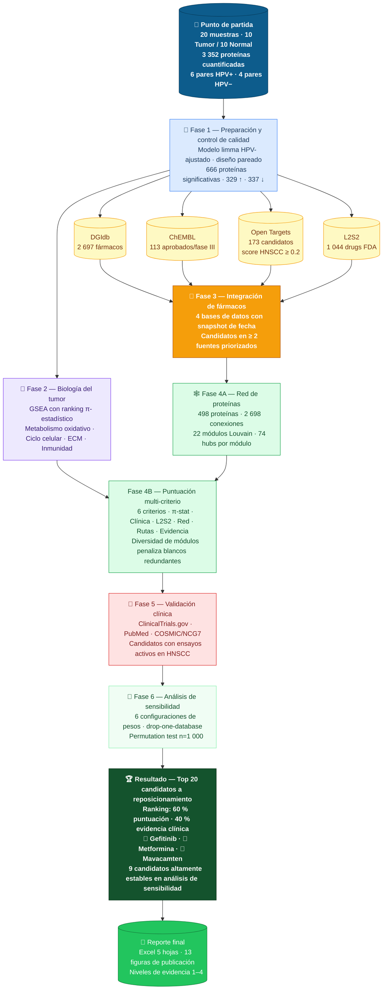

# Diagrama de flujo — Reposicionamiento de fármacos en HNSCC

> **¿Qué hace este proyecto?**
> A partir de muestras de tejido tumoral de pacientes con cáncer de cabeza y cuello (HNSCC),
> identificamos qué proteínas están alteradas y usamos bases de datos farmacológicas para proponer
> qué fármacos ya aprobados podrían funcionar contra este cáncer —
> estrategia llamada **reposicionamiento de fármacos**.

---

---

## Descripción detallada de cada fase

| Fase | Paso | Qué se hace | Resultado clave |
| ------ | ------ | ------------- | ----------------- |
| 📂 Preparación | ① Control de calidad | Modelo limma HPV-ajustado con `duplicateCorrelation()` para diseño pareado tumor/normal | 666 proteínas significativas (|logFC|>1, FDR<0.05) · 329 ↑ · 337 ↓ |
| | ② Traducción de IDs | Convertir códigos internos UniProt a nombres de genes reconocibles | 3 262 de 3 352 proteínas mapeadas (97.3 %) |
| 🧬 Biología | ③ Análisis de rutas | GSEA con ranking π-estadístico (`sign(logFC) × |logFC| × −log10(FDR)`). ORA para GO, KEGG, Reactome | Metabolismo oxidativo · ciclo celular · matriz extracelular · inmunidad |
| 💊 Fármacos | ④ Consulta a bases de datos | Buscar en 4 bases de datos independientes qué fármacos conocidos actúan sobre las proteínas alteradas. Open Targets filtrado por score HNSCC ≥ 0.2 | Candidatos únicos en ≥ 2 fuentes priorizados |
| 🕸️ Red | ⑤ Red de proteínas | Red STRING ≥ 700. Detección de módulos Louvain (22 módulos). Hubs = top 10 % betweenness dentro de cada módulo | 498 proteínas · 2 698 conexiones · 74 hubs modulares |
| | ⑥ Puntuación integrada | 6 criterios: π-stat (0.25), clínica (0.20), rutas (0.15), red (0.15), evidencia (0.15), L2S2 (0.10) | Top 20 candidatos con ranking objetivo |
| 🏥 Validación | ⑦ Evidencia clínica | ClinicalTrials.gov + PubMed por candidato. Cruce con oncogenes COSMIC/NCG7 | Candidatos con ensayos activos en HNSCC identificados |
| 🔁 Sensibilidad | ⑧ Robustez del ranking | 6 configuraciones de pesos + drop-one-database + permutation test (n=1 000) | 9 candidatos altamente estables en todas las configuraciones |
| 🏆 Resultado | ⑨ Ranking final | Score combinado 60 % multi-criterio + 40 % evidencia clínica | Top 20 · #1 Gefitinib · #2 Metformina · #3 Mavacamten |

---

## Leyenda de colores

| Color | Fase |
|-------|------|
| 🔵 Azul oscuro | Datos de entrada |
| 🔵 Azul claro | Fase 1 — Preparación |
| 🟣 Morado | Fase 2 — Biología |
| 🟡 Amarillo | Fase 3 — Bases de datos de fármacos |
| 🟠 Naranja | Integración de fuentes |
| 🟢 Verde claro | Fase 4 — Red y puntuación |
| 🔴 Rojo claro | Fase 5 — Validación clínica |
| 🟢 Verde muy claro | Fase 6 — Análisis de sensibilidad |
| 🟢 Verde oscuro | Resultado final |

---

*Pipeline completado: 2026-03-08 · 16 scripts (01–15, 17) · R + Python*
*Correcciones metodológicas aplicadas: 2026-03-08 (commits a46ca45–2a4e572)*
