```mermaid
flowchart TD

    %% ═══════════════════════════════════════════════════════
    %%  INPUT
    %% ═══════════════════════════════════════════════════════
    DATA[("🔬 Punto de partida
    20 muestras de tejido de pacientes
    10 Tumor  ·  10 Tejido sano
    Cáncer de cabeza y cuello — HNSCC
    ━━━━━━━━━━━━━━━━━━━━━━━
    3 352 proteínas cuantificadas")]

    %% ═══════════════════════════════════════════════════════
    %%  FASE 1 — Preparación
    %% ═══════════════════════════════════════════════════════
    subgraph P1["📂  Fase 1 — Preparación de datos"]
        QC["① Control de calidad
        Verificar integridad, distribución
        y validez estadística de los datos
        ────────────────────
        🔎 520 proteínas con cambios
        significativos en el tumor
        (248 aumentadas · 272 disminuidas)"]

        IDMAP["② Traducción de identificadores
        Los códigos internos de proteínas
        se convierten a nombres de genes
        ────────────────────
        ✅ 97.3 % de proteínas traducidas
        (3 263 de 3 352)"]
    end

    %% ═══════════════════════════════════════════════════════
    %%  FASE 2 — Biología alterada
    %% ═══════════════════════════════════════════════════════
    subgraph P2["🧬  Fase 2 — ¿Qué biología está alterada en el tumor?"]
        PATH["③ Análisis de procesos biológicos
        Se identifican cuáles funciones celulares
        están sobreactivadas o apagadas en el tumor
        ────────────────────
        Procesos clave alterados:
        ▸ Metabolismo mitocondrial (energía celular)
        ▸ División y crecimiento celular
        ▸ Matriz extracelular (estructura del tejido)
        ▸ Respuesta inmune e inflamación"]
    end

    %% ═══════════════════════════════════════════════════════
    %%  FASE 3 — Búsqueda de fármacos
    %% ═══════════════════════════════════════════════════════
    subgraph P3["💊  Fase 3 — ¿Qué fármacos existen para estas proteínas?"]
        DB1[("DGIdb
        Base de datos de interacciones
        entre genes y fármacos
        ────────────
        2 252 fármacos identificados
        para 226 de las 520 proteínas")]

        DB2[("ChEMBL
        Compuestos bioactivos
        y fases de ensayo clínico
        ────────────
        55 fármacos aprobados
        309 proteínas con diana")]

        DB3[("Open Targets
        Evidencia gen-enfermedad
        en base de datos global
        ────────────
        66 candidatos a reposicionamiento
        354 proteínas con evidencia HNSCC")]

        DB4[("CMap2
        Perfiles de expresión génica
        de miles de compuestos
        ────────────
        174 compuestos que invierten
        el perfil del tumor")]

        INT["④ Integración de las 4 fuentes
        ──────────────────────────────────
        🔗 2 421 fármacos únicos identificados
        📌 187 respaldados por ≥ 2 fuentes independientes
        Clasificación:
        A · Aprobado para HNSCC  (1)
        B · Aprobado para otro cáncer  (51)
        C · Aprobado para otra enfermedad  (80)
        D · En investigación  (2 289)"]
    end

    %% ═══════════════════════════════════════════════════════
    %%  FASE 4 — Red y puntuación
    %% ═══════════════════════════════════════════════════════
    subgraph P4["🕸️  Fase 4 — Red de proteínas y puntuación integrada"]
        NET["⑤ Red de interacciones entre proteínas
        Se construye un mapa de cómo se
        conectan entre sí las proteínas tumorales
        ────────────────────
        403 proteínas  ·  2 001 conexiones
        41 proteínas 'hub' (los nodos más conectados)
        🎯 Hallazgo clave: todos los hubs son
        subunidades del Complejo I mitocondrial
        → diana conocida de la Metformina"]

        SCO["⑥ Puntuación multi-criterio
        Cada fármaco candidato recibe una puntuación
        que combina 6 dimensiones independientes
        ────────────────────
        ▸ Nivel de expresión de la proteína blanco
        ▸ Fase clínica del fármaco (aprobado = más puntos)
        ▸ Inversión del perfil tumoral (CMap)
        ▸ Relevancia en las rutas alteradas
        ▸ Centralidad en la red de proteínas
        ▸ Significancia estadística
        ────────────────────
        177 candidatos evaluados"]
    end

    %% ═══════════════════════════════════════════════════════
    %%  FASE 5 — Validación clínica
    %% ═══════════════════════════════════════════════════════
    subgraph P5["🏥  Fase 5 — Validación con evidencia clínica"]
        CT[("ClinicalTrials.gov
        Se buscan ensayos clínicos
        activos de cada candidato
        específicamente en HNSCC
        ────────────
        11 de 20 candidatos ya tienen
        ensayos clínicos en este cáncer
        8 de ellos activos en 2026")]

        COS[("Genes driver de cáncer
        Se cruzan los targets con
        oncogenes reportados en
        literatura científica de HNSCC
        ────────────
        EGFR: gen driver principal
        (logFC = 4.33 en tumor)")]
    end

    %% ═══════════════════════════════════════════════════════
    %%  RESULTADO
    %% ═══════════════════════════════════════════════════════
    subgraph P6["🏆  Resultado final — Candidatos a reposicionamiento"]
        TOP["⑦ Top 20 fármacos candidatos para HNSCC
        Ranking final combinado:
        60 % puntuación multi-criterio
        40 % evidencia clínica disponible
        ══════════════════════════════
        🥇 Erlotinib     🥈 Cetuximab
        🥉 Metformina    4° Lapatinib
        5° Doxiciclina   ···  Top 20"]

        OUT[("📄 Entregables finales
        Archivo Excel · 5 hojas de resultados
        14 figuras listas para publicación
        Niveles de evidencia 1–4
        por cada candidato")]
    end

    %% ═══════════════════════════════════════════════════════
    %%  FLUJO DE CONEXIONES
    %% ═══════════════════════════════════════════════════════
    DATA --> QC --> IDMAP
    IDMAP --> PATH
    IDMAP --> DB1 & DB2 & DB3 & DB4
    DB1 & DB2 & DB3 & DB4 --> INT
    PATH --> SCO
    INT --> NET --> SCO
    SCO --> CT & COS
    CT & COS --> TOP --> OUT

    %% ═══════════════════════════════════════════════════════
    %%  ESTILOS
    %% ═══════════════════════════════════════════════════════
    classDef input  fill:#0d5c8c,color:#ffffff,stroke:#063d5e,font-weight:bold
    classDef p1     fill:#dbeafe,color:#1e3a5f,stroke:#3b82f6
    classDef p2     fill:#ede9fe,color:#3b1f7a,stroke:#7c3aed
    classDef dbase  fill:#fef9c3,color:#78350f,stroke:#f59e0b
    classDef integ  fill:#f59e0b,color:#ffffff,stroke:#b45309,font-weight:bold
    classDef p4     fill:#dcfce7,color:#14532d,stroke:#16a34a
    classDef p5     fill:#fee2e2,color:#7f1d1d,stroke:#dc2626
    classDef result fill:#14532d,color:#ffffff,stroke:#052e16,font-weight:bold
    classDef output fill:#22c55e,color:#ffffff,stroke:#15803d,font-weight:bold

    class DATA input
    class QC,IDMAP p1
    class PATH p2
    class DB1,DB2,DB3,DB4 dbase
    class INT integ
    class NET,SCO p4
    class CT,COS p5
    class TOP result
    class OUT output
```

# Diagrama de flujo — Reposicionamiento de fármacos en HNSCC

> **¿Qué hace este proyecto?**
> A partir de muestras de tejido tumoral de pacientes con cáncer de cabeza y cuello (HNSCC),
> identificamos qué proteínas están alteradas y usamos inteligencia artificial y bases de datos
> farmacológicas para proponer qué fármacos ya aprobados (para otras enfermedades) podrían
> funcionar contra este cáncer — una estrategia llamada **reposicionamiento de fármacos**.

---

---

## Leyenda de colores

| Color | Fase |
|-------|------|
| 🔵 Azul oscuro | Datos de entrada |
| 🔵 Azul claro | Fase 1 — Preparación |
| 🟣 Morado | Fase 2 — Biología |
| 🟡 Amarillo | Fase 3 — Bases de datos de fármacos |
| 🟠 Naranja | Integración de fuentes |
| 🟢 Verde claro | Fase 4 — Red y puntuación |
| 🔴 Rojo claro | Fase 5 — Validación clínica |
| 🟢 Verde oscuro | Resultado final |

---

*Pipeline completado: 2026-03-04 · 17 scripts · R + Python*
