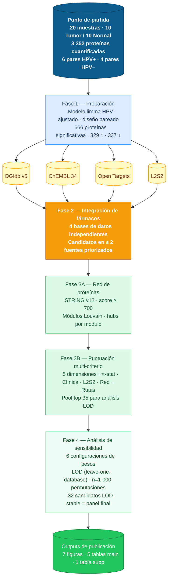

# Diagrama de flujo — Reposicionamiento de fármacos en HNSCC

> **¿Qué hace este proyecto?**
> A partir de muestras de tejido tumoral de pacientes con cáncer de cabeza y cuello (HNSCC),
> identificamos qué proteínas están alteradas y usamos bases de datos farmacológicas para proponer
> qué fármacos ya aprobados podrían funcionar contra este cáncer —
> estrategia llamada **reposicionamiento de fármacos**.

---

---

## Descripción de cada fase

| Fase | Scripts | Qué se hace | Resultado clave |
| --- | --- | --- | --- |
| Preparación | 01, 02 | Modelo limma HPV-ajustado con `duplicateCorrelation()`. Mapeo UniProt → Entrez/Symbol | 666 proteínas DE (\|logFC\|>1, FDR<0.05) · 97.3 % mapeadas |
| Consulta BD | 04–07 | DGIdb, ChEMBL (fase ≥ 3), Open Targets, L2S2 (reversión transcriptómica) | Candidatos en ≥ 2 fuentes priorizados |
| Integración | 08 | Unificar 4 fuentes. Clasificar A/B/C/D. Multi-source candidates | Tabla maestra · 187 candidatos multi-fuente |
| Red PPI | 09 | STRING v12 REST API. Módulos Louvain. Hubs = top 10 % betweenness por módulo | Red + métricas de centralidad · hubs druggables |
| Scoring | 10 | 5 dimensiones ponderadas (ver `config/analysis_params.yaml`) | Pool top 35 candidatos |
| Sensibilidad | 15 | 6 configs de pesos + LOD + permutation test (n=1 000) | 32 candidatos LOD-stable = panel definitivo |
| Publicación | 17, 18 | Figuras y tablas publication-ready (PDF + PNG 300 DPI) | 7 figuras · 6 tablas |

---

Pipeline: 12 scripts (01–02, 04–10, 15, 17–18) · R + Python · Completado: 2026-03-08
