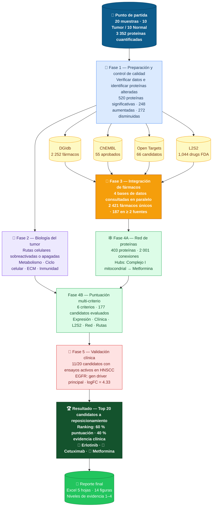

# Diagrama de flujo — Reposicionamiento de fármacos en HNSCC

> **¿Qué hace este proyecto?**
> A partir de muestras de tejido tumoral de pacientes con cáncer de cabeza y cuello (HNSCC),
> identificamos qué proteínas están alteradas y usamos bases de datos farmacológicas para proponer
> qué fármacos ya aprobados podrían funcionar contra este cáncer —
> estrategia llamada **reposicionamiento de fármacos**.

---

---

## Descripción detallada de cada fase

| Fase | Paso | Qué se hace | Resultado clave |
| ------ | ------ | ------------- | ----------------- |
| 📂 Preparación | ① Control de calidad | Verificar integridad, distribución y validez estadística de los datos proteómicos | 520 proteínas significativamente alteradas (248 ↑ · 272 ↓) |
| | ② Traducción de IDs | Convertir códigos internos UniProt a nombres de genes reconocibles | 3 263 de 3 352 proteínas mapeadas (97.3 %) |
| 🧬 Biología | ③ Análisis de rutas | Identificar qué funciones celulares están sobreactivadas o apagadas en el tumor usando GO, KEGG, Reactome y Hallmarks | Metabolismo mitocondrial · ciclo celular · matriz extracelular · inmunidad |
| 💊 Fármacos | ④ Consulta a bases de datos | Buscar en 4 bases de datos independientes qué fármacos conocidos actúan sobre las proteínas alteradas | 2 421 fármacos únicos · 187 respaldados por ≥ 2 fuentes |
| 🕸️ Red | ⑤ Red de proteínas | Construir mapa de conexiones entre las proteínas tumorales para identificar las más importantes (hubs) | 403 proteínas · 2 001 conexiones · Hubs = Complejo I mitocondrial |
| | ⑥ Puntuación integrada | Asignar un puntaje a cada candidato combinando 6 criterios independientes | 177 candidatos evaluados con ranking objetivo |
| 🏥 Validación | Ensayos clínicos | Buscar en ClinicalTrials.gov si los candidatos ya tienen estudios en HNSCC | 11 de 20 con ensayos · 8 activos en 2026 |
| | Genes driver | Cruzar los targets con oncogenes conocidos de cáncer de cabeza y cuello | EGFR: gen driver principal (logFC = 4.33) |
| 🏆 Resultado | ⑦ Ranking final | Combinar puntuación multi-criterio (60 %) con evidencia clínica (40 %) | Top 20 candidatos · #1 Erlotinib · #2 Cetuximab · #3 Metformina |

---

## Leyenda de colores

| Color | Fase |
|-------|------|
| 🔵 Azul oscuro | Datos de entrada |
| 🔵 Azul claro | Fase 1 — Preparación |
| 🟣 Morado | Fase 2 — Biología |
| 🟡 Amarillo | Fase 3 — Bases de datos de fármacos |
| 🟠 Naranja | Integración de fuentes |
| 🟢 Verde claro | Fase 4 — Red y puntuación |
| 🔴 Rojo claro | Fase 5 — Validación clínica |
| 🟢 Verde oscuro | Resultado final |

---

*Pipeline completado: 2026-03-04 · 17 scripts · R + Python*
